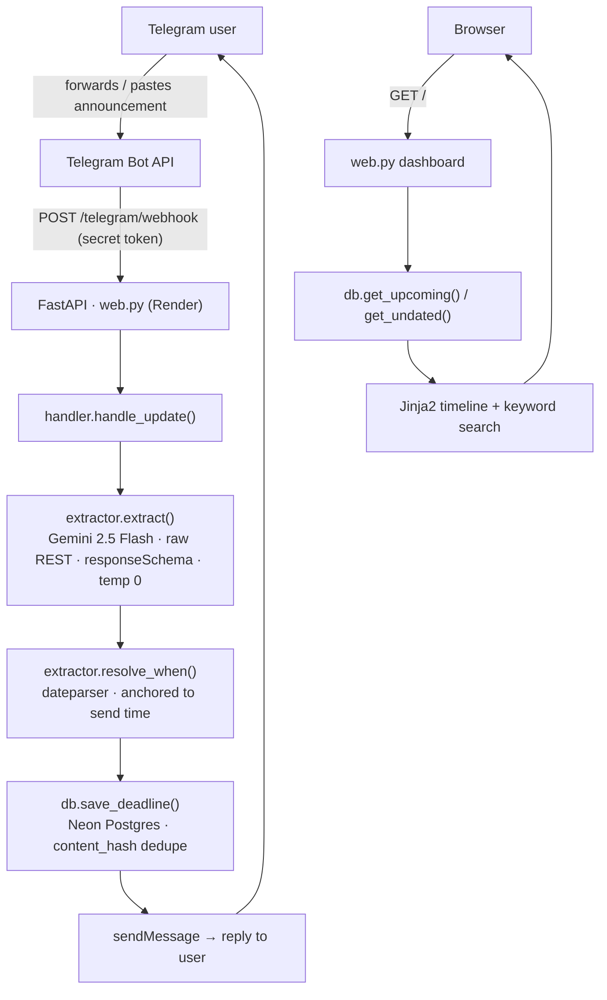

# deadline-bot

Forward an announcement to a Telegram bot. It pulls the deadline out into structured data with a single LLM call and drops it onto a dashboard you can search.

**Live:** https://deadline-bot-pgx8.onrender.com/

## Demo


## Architecture



It's one FastAPI service doing two jobs. `web.py` serves the dashboard, and it also hosts the Telegram webhook at `POST /telegram/webhook`. The webhook and the local long-poll loop in `bot.py` both call the same `handler.handle_update()`, so dev and prod can't quietly drift apart. Extraction and date resolution live in `extractor.py`. Every Postgres query lives in `db.py`. The stack is Python 3.12, FastAPI, psycopg v3, PostgreSQL on Neon, and Gemini 2.5 Flash over plain REST, all running on Render's free tier.

## How it works

1. **Ingest** — Telegram POSTs each message to the webhook, which is guarded by a secret token.
2. **Extract** — one Gemini call comes back as structured JSON: a `has_deadline` gate, the fields, and `when_text`, which is the date phrase copied out verbatim.
3. **Resolve** — Python takes `when_text` and turns it into a real `date` using `dateparser`, anchored to when the message was sent. The model is never asked to do calendar math.
4. **Store** — the row goes into Postgres with a SHA-256 `content_hash` and `ON CONFLICT DO NOTHING`, so a redelivered message changes nothing.
5. **Surface** — the bot replies to the user. The dashboard lists upcoming deadlines soonest-first, with a separate "needs review" block for the ones whose date didn't resolve, and keyword search across both.

## Design decisions

**The LLM copies a phrase, Python figures out the date.** The model hands back `when_text` ("this Sunday", "the 25th") exactly as written and never converts it to anything. `resolve_when()` does the conversion with `dateparser`, using `RELATIVE_BASE` to anchor on the message's send time and `PREFER_DATES_FROM="future"`, since a deadline points forward. Two reasons for the split: LLMs are shaky at calendar arithmetic, and the model has no way of knowing what day the message was sent. A deterministic resolver is also something you can actually write tests for. `dateparser` has two gaps I patch in code: a bare `"next/this <weekday>"`, and lone ordinals like `"the 25th"`.

**The same message twice doesn't produce two rows.** Dedupe is a SHA-256 of the normalized `raw_text`, stored in a `UNIQUE` column, with `INSERT ... ON CONFLICT (content_hash) DO NOTHING`. Telegram keeps retrying a webhook until it gets a 200 back, so the same update genuinely does arrive more than once. Reprocessing it is a no-op instead of a duplicate.

**Raw REST for Gemini instead of the SDK.** The API key has an `AQ.` prefix that the official SDK rejects before the request even leaves the machine. A plain `POST` with the `x-goog-api-key` header, `responseMimeType=application/json`, a `responseSchema` and `temperature=0` works fine, and it keeps the dependency list short.

**Webhook, not long-poll.** Long-poll needs a worker process sitting there running forever. A webhook is just an HTTP endpoint, so the bot and the dashboard fold into one Render service, and it's what you'd use in production anyway. The webhook handler is a sync `def`, which means FastAPI pushes the blocking model, DB and HTTP work onto its threadpool. I kept `bot.py` around for local dev because long-poll doesn't need a public URL, and both transports go through `handler.handle_update()` regardless.

**A connection per call, prepared statements off.** Every DB operation opens its own connection via `db._connect(prepare_threshold=None)`. Neon's pooled endpoint is PgBouncer in transaction mode, so you don't get any guarantee that two statements land on the same backend connection. Server-side prepared statements would break under that. Turning them off keeps the pooled path safe.

## Running locally

```bash
py -3.12 -m venv .venv
.venv\Scripts\Activate.ps1          # PowerShell (Windows); use source .venv/bin/activate elsewhere
pip install -r requirements.txt
cp .env.example .env                 # then fill in the tokens/URLs
python db.py                         # creates the schema -> "Schema ready."
```

Then pick a transport:

```bash
# local dev — long-poll, no public URL needed; just message the bot
python bot.py

# dashboard (also serves the production webhook route)
uvicorn web:app --reload             # http://127.0.0.1:8000/
```

In production the bot runs as a webhook. `web.py` is deployed on Render and registered with Telegram's `setWebhook`, pointing at `/telegram/webhook` with the secret token. `.python-version` pins 3.12 so the host doesn't wander off to 3.14, where psycopg wheels have been flaky.

## Known limitations

- **Timezones.** Dates are resolved against the send time in whatever timezone `BOT_TZ` is set to. A message that lands near the IST/UTC midnight boundary can push a relative "tomorrow" a day off.
- **Cold starts on the free tier.** Render puts the service to sleep after about 15 minutes idle, and the first request after that takes 30–60s to wake it up.
- **Extraction is only as good as the model.** That's the ceiling. Note that messages which mention a date but don't actually ask you to do anything (say, "biryani night this Friday") get filtered out with `has_deadline=false`, and that's intentional.
