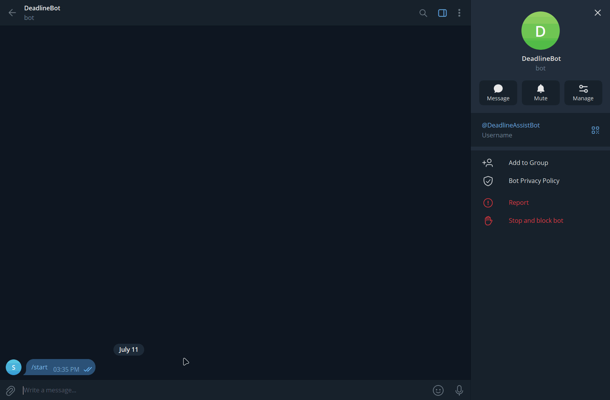
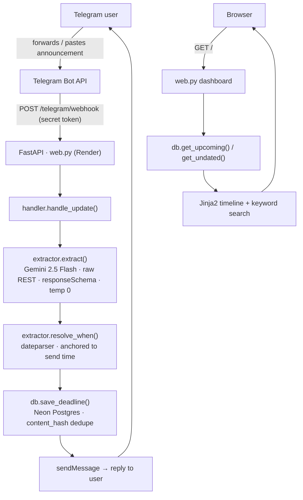

# deadline-bot

Forward a college announcement to a Telegram bot; it extracts the deadline into structured data with one LLM call and surfaces it on a searchable dashboard.

**Live:** https://deadline-bot-pgx8.onrender.com/

## Demo



## Architecture



One FastAPI service (`web.py`) does two jobs: it serves the dashboard **and** hosts the Telegram webhook at `POST /telegram/webhook`. Both the webhook and the local-dev long-poll loop (`bot.py`) call the same `handler.handle_update()`, so dev and prod share one code path and can't drift. Extraction and date resolution live in `extractor.py`; all Postgres access is in `db.py`. Stack: Python 3.12, FastAPI, psycopg v3, PostgreSQL (Neon), Gemini 2.5 Flash via raw REST — deployed free on Render.

## How it works

1. **Ingest** — Telegram delivers each message to the webhook as an HTTP POST, guarded by a secret token.
2. **Extract** — one Gemini call returns structured JSON: a `has_deadline` gate, the fields, and `when_text` (the date phrase copied verbatim).
3. **Resolve** — Python turns `when_text` into a real `date` via `dateparser`, anchored to the message's send time — the model never does calendar math.
4. **Store** — the row is inserted into Postgres with a SHA-256 `content_hash` and `ON CONFLICT DO NOTHING`, so re-delivery is a no-op.
5. **Surface** — the bot replies to the user; the dashboard lists upcoming deadlines (soonest first) plus a "needs review" block for ones whose date didn't resolve, with keyword search over both.

## Design decisions

**The LLM extracts a phrase; Python computes the date.** The model returns `when_text` ("this Sunday", "the 25th") verbatim and never converts it. `resolve_when()` resolves it with `dateparser`, anchored via `RELATIVE_BASE` to the message's send time and `PREFER_DATES_FROM="future"` (a deadline points forward). LLMs are unreliable at calendar arithmetic and can't know the send date; a deterministic resolver is testable and reproducible. Two `dateparser` gaps are patched in code: bare `"next/this <weekday>"` and lone ordinals like `"the 25th"`.

**Idempotent by construction.** Dedupe is a SHA-256 of the normalized `raw_text` stored in a `UNIQUE` column, with `INSERT ... ON CONFLICT (content_hash) DO NOTHING`. Telegram retries a webhook until it gets a 200, so the same update can arrive more than once — this makes reprocessing a no-op instead of a duplicate row.

**Raw REST for Gemini, no SDK.** The API key carries an `AQ.` prefix that the official SDK rejects client-side. A plain `POST` with the `x-goog-api-key` header, `responseMimeType=application/json`, a `responseSchema`, and `temperature=0` works and keeps the dependency surface small.

**Webhook over long-poll.** Long-poll needs a persistent worker process; a webhook is just an HTTP endpoint, so the bot and the dashboard collapse into a single Render service — and it's the production-standard pattern. The webhook handler is a sync `def`, so FastAPI runs the blocking model/DB/HTTP work in its threadpool. `bot.py` (long-poll) is kept for local dev because it needs no public URL, and both transports share `handler.handle_update()`.

**Connection-per-call with prepared statements off.** Each DB operation opens its own connection through `db._connect(prepare_threshold=None)`. Neon's pooled endpoint is PgBouncer in transaction mode, which can't guarantee the same backend connection across statements, so server-side prepared statements would break — disabling them keeps the pooled path safe.

## Running locally

```bash
py -3.12 -m venv .venv
.venv\Scripts\Activate.ps1          # PowerShell (Windows); use source .venv/bin/activate elsewhere
pip install -r requirements.txt
cp .env.example .env                 # then fill in the tokens/URLs
python db.py                         # creates the schema -> "Schema ready."
```

Then pick a transport:

```bash
# local dev — long-poll, no public URL needed; just message the bot
python bot.py

# dashboard (also serves the production webhook route)
uvicorn web:app --reload             # http://127.0.0.1:8000/
```

In production the bot runs as a webhook: `web.py` is deployed on Render and registered with Telegram's `setWebhook` pointing at `/telegram/webhook` with the secret token. `.python-version` pins 3.12 so the host doesn't drift to 3.14 (where psycopg wheels have been flaky).

## Known limitations

- **Timezone edge case.** Date resolution is anchored to the send time in a configured timezone (`BOT_TZ`); a message sent near the IST/UTC midnight boundary can shift a relative "tomorrow" by one day.
- **Free-tier cold start.** Render idles the service after ~15 minutes; the first request after idle takes 30–60s to wake.
- **Extraction is model-bounded.** Quality is capped by the LLM. By design, events that merely mention a date but carry no actionable deadline (e.g. "biryani night this Friday") are gated out with `has_deadline=false`.
