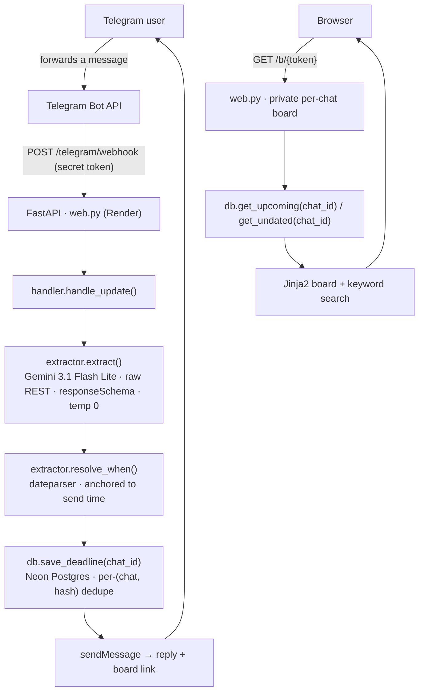

# deadline-bot

Forward it a message that's got a deadline hiding in it and it reads the date out, saves it, and hands you back a link to your own private board. It started as a thing for college announcements (assignment due dates, exam fees, that sort of noise) but there's nothing college-specific left in it. A bill, an insurance renewal, an appointment reminder, whatever. As long as the message is actually asking you to do something by some date, it'll catch it.

**Live:** https://deadline-bot-pgx8.onrender.com/  — free tier, so give it a few seconds to wake up if it's been idle.

## Demo


## How it works

One model call does the reading, Python does the date math, Postgres keeps the result. That's the whole loop.

1. Telegram POSTs your message to a webhook. There's a secret token on it so nobody can just POST junk at the endpoint.
2. Gemini reads the text and returns structured JSON: `has_deadline`, a title, some tags, and `when_text`, which is the date phrase *copied out exactly* ("this Sunday", "the 25th"). It doesn't try to work out an actual calendar date. There's a reason for that below.
3. Python turns `when_text` into a real date with `dateparser`, anchored to when you actually sent the message.
4. The row goes into Postgres, stamped with your chat id and deduped, so if Telegram redelivers the same update nothing doubles up.
5. You get a reply with what it found plus your board link. The board is just your deadlines, soonest first, with a search box and a small "needs review" pile for anything whose date wouldn't parse.

## Architecture



It's one FastAPI service doing two jobs. `web.py` hosts the Telegram webhook at `POST /telegram/webhook` and also serves each user their own board at `/b/{token}`. The root `/` is just a landing page; there's no shared dashboard anywhere. The webhook and the local long-poll loop in `bot.py` both go through the same `handler.handle_update()`, so dev and prod can't quietly drift apart. Extraction and date resolution live in `extractor.py`, and every Postgres query is in `db.py`. Stack is Python 3.12, FastAPI, psycopg v3, Postgres on Neon, and Gemini 3.1 Flash Lite over plain REST, all on Render's free tier.

## Design decisions

The parts that weren't obvious going in, mostly.

### Let the model copy the phrase, let Python do the date

The model hands back `when_text` word for word and never converts it. The actual conversion happens in `resolve_when()` with `dateparser`, anchored to the send time (`RELATIVE_BASE`) and biased forward (`PREFER_DATES_FROM="future"`), because a deadline is a future thing.

Why split it up? Two reasons. LLMs are genuinely bad at "what's the date two Fridays from now," and they don't even know what day the message was sent, so they'd be guessing. And a plain Python function is something you can unit-test, which the model isn't.

`dateparser` does have a couple of blind spots I patch by hand — bare "next/this weekday" phrases, and lone ordinals like "the 25th". Small stuff, but wrong often enough to matter.

### Dedupe per person, not globally

Every deadline gets a SHA-256 of its normalized text, with a `UNIQUE(chat_id, content_hash)` on the table and `ON CONFLICT DO NOTHING`. Telegram keeps retrying a webhook until it gets a 200 back, so the same message really does arrive more than once, and this makes the repeats no-ops.

I got this wrong the first time by making the hash unique *globally*. Which seems fine right up until two people forward the same class announcement and the second one just loses it, because the first person's row already owns that hash. Scoping the constraint to the chat fixes it and keeps the retry-safety.

### Boards are unguessable links, and that's the whole auth story

The first time a chat messages the bot it gets a board at `/b/<token>`, where the token is a `secrets.token_urlsafe(16)` string. No accounts, no passwords. Whoever has the link sees that one board and nothing else, and the root URL shows nobody anything. For a "I just want to track my own deadlines" tool that's the right amount of security, and it keeps the surface tiny. The catch is that the link is a bearer token, so anyone you share it with can see your board (it's in the limitations).

### Raw REST for Gemini, no SDK

Small but annoying one. The API key on this project has an `AQ.` prefix that the official SDK rejects before it even makes a call. So it's a plain `POST` with the `x-goog-api-key` header, `responseMimeType=application/json`, a `responseSchema`, and `temperature=0`. Keeps the dependency list shorter anyway.

### The model switch was a quota story, not a quality one

This one had me stuck for a while. The bot got slow (~12s a message) and then started throwing 429s, and I was sure I'd written the backoff wrong. Turned out the actual `error.details` in the 429 body said `gemini-2.5-flash` on this project's free tier is capped at **20 requests a day**. Twenty. The rate-limit tables you find online said something totally different, because they describe a config I don't have.

Quotas are per-model, so I moved to `gemini-3.1-flash-lite` — different bucket entirely: 500 a day, 15 a minute, and about 1.4s a call instead of twelve. It's also just the right size for the job. This is a yes/no classification plus copying a phrase out; there's no reasoning to pay for.

The retry loop reads that body properly now. A per-*day* cap it gives up on immediately (no point sleeping against a wall that won't move until tomorrow), while a per-minute one it waits out for exactly as long as the server's `retryDelay` says.

### Webhook, not long-poll

Long-poll means a worker process sitting there running forever. A webhook is just an HTTP route, so the bot and the web app fold into a single Render service, which is also how you'd run it in production. The handler is a plain sync `def`, so FastAPI runs the blocking model/DB/HTTP work on its threadpool. `bot.py` still does long-poll for local dev, since that doesn't need a public URL. Both paths call the same `handle_update()`.

### One connection per call, prepared statements off

Every query opens its own connection through `db._connect(prepare_threshold=None)`. Neon's pooled endpoint is PgBouncer in transaction mode, so two statements in a row aren't guaranteed to hit the same backend connection, and server-side prepared statements fall over when that happens. Turning them off is the fix.

### One stylesheet, no build step

The board and landing page are server-rendered HTML with a single hand-written CSS file. No React, no Tailwind, no bundler, not even a web font. Most people open their board on a phone straight out of Telegram, so it's built mobile-first and the whole page is one request. It's never going to win a design award, but it loads instantly and the contrast passes AA, which was the whole bar: don't make someone wince when they click the link.

## Running locally

```bash
py -3.12 -m venv .venv
.venv\Scripts\Activate.ps1          # PowerShell (Windows); use source .venv/bin/activate elsewhere
pip install -r requirements.txt
cp .env.example .env                 # then fill in the tokens/URLs
python db.py                         # creates the schema -> "Schema ready."
```

Then pick a transport:

```bash
# local dev — long-poll, no public URL needed; just message the bot
python bot.py

# web app: landing page + private boards (/b/<token>) + the webhook route
uvicorn web:app --reload             # http://127.0.0.1:8000/
```

In production it runs as a webhook. `web.py` is deployed on Render and registered with Telegram's `setWebhook`, pointing at `/telegram/webhook` with the secret token. `.python-version` pins 3.12 so the host doesn't wander off to 3.14, where the psycopg wheels have been flaky.

## Known limitations

- **Timezones.** Dates resolve against the send time in whatever timezone `BOT_TZ` is set to. A message landing near the IST/UTC midnight line can push a relative "tomorrow" a day off.
- **Cold starts.** Render sleeps the service after ~15 minutes idle, so the first request after that takes 30 to 60 seconds to wake it up.
- **It's only as good as the model.** That's the ceiling. Worth knowing: a message that mentions a date but doesn't actually ask you to do anything ("biryani night this Friday") gets filtered out with `has_deadline=false`. That's on purpose.
- **Board links are bearer URLs.** Anyone with your `/b/<token>` link can see that board, since there's no login. The token's unguessable, but treat the link like a password and don't post it anywhere public.
